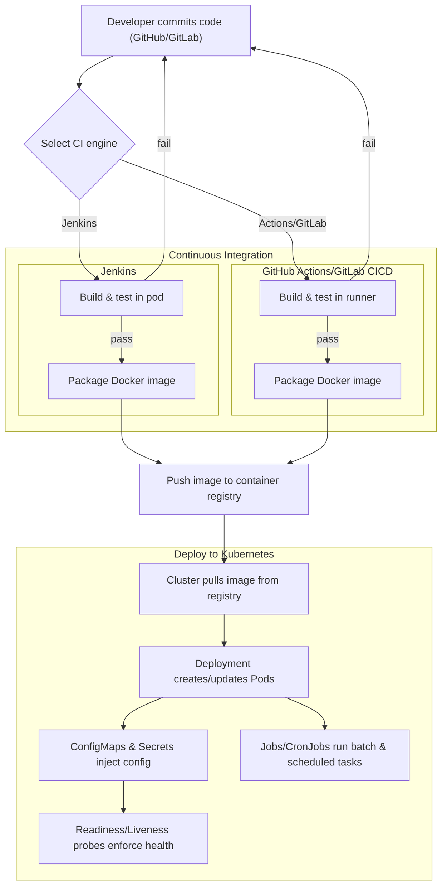

# CI/CD to Kubernetes: The Big Picture

**Q: Are Jenkins and GitHub Actions/GitLab CI/CD mutually exclusive?**

**A:** Not at all! Teams often use them together. GitHub/GitLab CI is great for repo-native builds and quick checks, while Jenkins excels at complex deployments, integrations, and on-prem environments. Many orgs run both in parallel during transitions or for different use cases.
